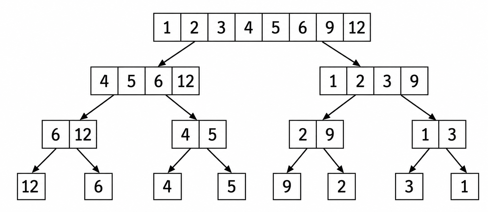

Searching and sorting are foundational concepts in computer science and problem solving. They are essential for efficiently organizing, accessing, and processing data in a wide range of applications—from databases and search engines to scientific computing and everyday software.

---

### Why Searching and Sorting?

Sorting data allows us to use efficient searching algorithms and solve complex problems more easily. For example, searching for a value in a sorted list can be done much faster than in an unsorted one.

---

### Sorting: The Merge Sort Example

One of the most efficient and widely used sorting algorithms is **merge sort**. Merge sort works by recursively dividing the list into halves, sorting each half, and then merging the sorted halves back together. This process is visualized below:

 <small>Figure: Merge sort recursively splits and merges the array to sort it efficiently.</small>

Merge sort is an example of a **divide and conquer** algorithm. It is efficient for large datasets and guarantees a time complexity of $O(n \log n)$.

---

### Searching

Searching is the process of finding a specific item or value within a collection of data. Common searching algorithms include:

- **Linear Search:** Checks each element one by one. Simple but slow for large data.
- **Binary Search:** Works on sorted data, repeatedly dividing the search interval in half. Much faster than linear search.

**Example:**

Suppose you have a sorted list: `[2, 5, 8, 12, 16, 23, 38, 56, 72, 91]`

To find 23 using binary search:

1. Compare with the middle element (16). 23 > 16, so search right half.
2. Next middle is 38. 23 < 38, so search left half.
3. Next middle is 23. Found!

---

### Problems You Will Solve

In this experiment, you will solve two main problems that require searching and sorting as key steps:

### 1. Triangle Problem

**Task:** Given a set of numbers, determine how many combinations cannot form a triangle. Sorting helps in efficiently checking combinations.

**Hint:** For three numbers $a, b, c$, they cannot form a triangle if $a + b < c$, $b + c < a$, or $c + a < b$. Sorting the numbers allows you to check these conditions efficiently, often using binary search.

### 2. Substring Problem

**Task:** Given a string and a set of characters, find the shortest substring containing all characters from the set. Searching and tracking positions are crucial for an efficient solution.

---

By mastering these techniques, you will be able to tackle a wide range of computational problems more effectively. The skills you learn here are foundational for advanced topics in algorithms and data structures.
